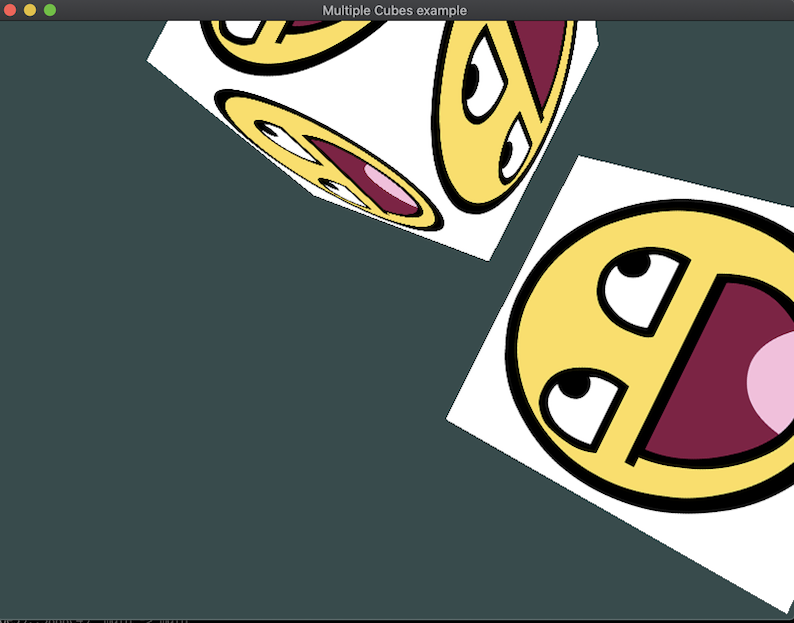

# Multiple Cubes

## How to run

`zig build multiple_cubes`

The key to drawing multiple cubes in our case is to reuse the view and projection matrices and individually create a model for each cube we want to draw.

```
// define view and projection matrices out here.
...
for(cube_positions) |p| {
    // define model matrix in here for each cube.
    ...
    // then draw it.
    sg.draw(0, 36, 1);
}
```


