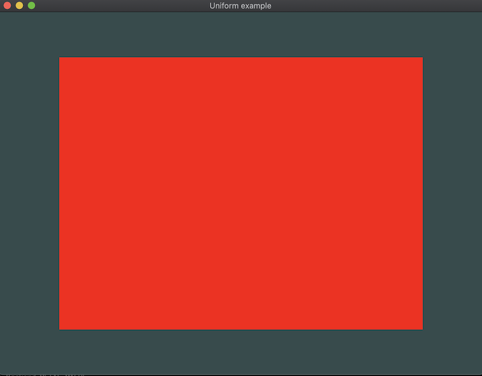

# Uniform

## How to run

`zig build uniform`

Renders a quad to a screen receiving a uniform variable from the main program.

```
const color: f32 = 1.0;
sg.applyUniforms(sg.ShaderStage.FS, 0, &color, @sizeOf(f32));
```

